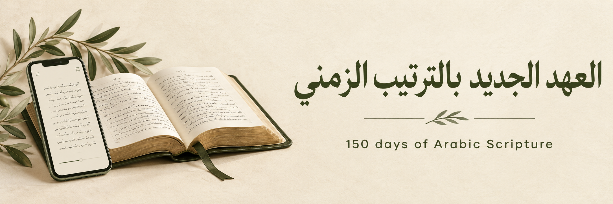
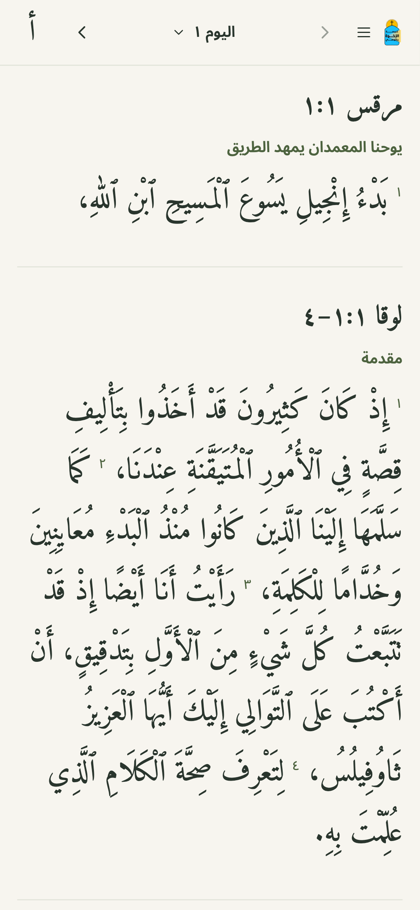

# The New Testament in Chronological Order<br /><span lang="ar" dir="rtl">العهد الجديد بالترتيب الزمني</span>

A calm Arabic New Testament reader built for the youth of the **Brethren Church at Kholousy**. Follow a 150-day chronological reading plan, with Scripture given almost the entire screen.

[Open the app](https://sfk-bible-reading.vercel.app/) · [Development guide](docs/development.md) · [Data sources](data/SOURCES.md)

[](https://github.com/albert429/Bible-NTin150Days/actions/workflows/checks.yml)

## Reading comes first

- One slim, sticky toolbar; the rest of the page is for reading.
- Clear Arabic text in Amiri, adjustable from 22–38px, with light and dark themes.
- Original passage order, Scripture section headings, verse numbers, and quick passage jumps.
- A personal start date, a 150-day calendar, completion with undo, and multiple readers on one device.
- Local progress, JSON backup/restore, and optional sharing initiated by the reader.
- Static frontend hosting, daily reading caches, nearby readings prepared in the background, and secondary screens loaded on demand.
- Optional recorded reading with verse highlighting, follow mode, and a small audio player; recordings load only when requested.

<p align="center">
  
</p>

## Made for daily reading together


Developed by **Albert Alfred** for the youth of the Brethren Church at Kholousy.

Contact: [albertalfred429@gmail.com](mailto:albertalfred429@gmail.com) · GitHub: [albert429](https://github.com/albert429)

The banner and community illustration are generated artwork. The mobile screenshot shows the actual app. [Artwork prompts and provenance](docs/design/image-prompts.md) are included in the repository.

## Run locally

Use **Node.js 22** and npm. No credentials or environment variables are required.

```sh
npm ci
npm run dev
```

Open `http://localhost:5173`. Development and production builds automatically generate the static reading files from `data/plan.json`.

```sh
npm run validate                    # Formatting, unit/data tests, production build
npx playwright install chromium webkit
npm run test:browser                # Mobile Chromium + WebKit, including accessibility
npm start                           # Preview the production build on port 4173
```

## Hosting and privacy

React, TypeScript, and Vite build a static `dist/` directory. Vercel settings are checked into `vercel.json`; use the Vite preset and `npm run build`. The app requires no backend, database, or public API.

Progress and appearance preferences stay in the current browser. There is no automatic account sync or live group tracking. Backups contain the reader's name, start date, and completed days; keep them private. Readings need a network connection on their first fetch; the app does not currently provide persistent offline access.

See the [development guide](docs/development.md) for architecture, deployment troubleshooting, source regeneration, and performance checks. Please read [CONTRIBUTING.md](CONTRIBUTING.md) before making changes.

Recorded readings use separately hosted static audio. See the [audio guide](docs/audio.md) for local preparation, timing review, CDN setup, and free-tier bandwidth estimates. A normal Git-only deployment keeps audio hidden until media is available or an audio host is configured.

## Scripture attribution and rights

The bundled Scripture is the **Arabic Van Dyck / فان دايك, eBible.org `arb-vd` edition**. eBible.org identifies this edition as **public domain**. Translation is credited to the Syrian Mission, with the American Bible Society listed as a contributor. This project claims **no copyright over the Scripture text**. This statement applies to the identified source edition; it does not make a claim about every modern Bible edition or its editorial material. [Source and rights statement](https://ebible.org/bible/details.php?id=arb-vd).

Amiri and Noto Sans Arabic are distributed under the SIL Open Font License 1.1. Application code has no open-source license grant. See [LICENSE](LICENSE) and [THIRD_PARTY_NOTICES.md](THIRD_PARTY_NOTICES.md) for the separate terms covering code, Scripture, fonts, and artwork.

---

<p>
  <sub> Built using <a href="https://react.dev/">React</a><br />
  Scripture data courtesy of <a href="https://ebible.org/bible/details.php?id=arb-vd">eBible.org</a> — Arabic Van Dyck, public domain.</sub>
</p>
